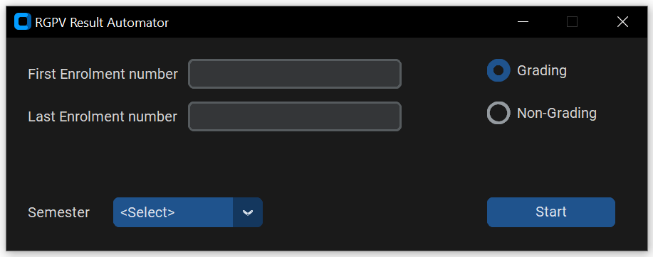
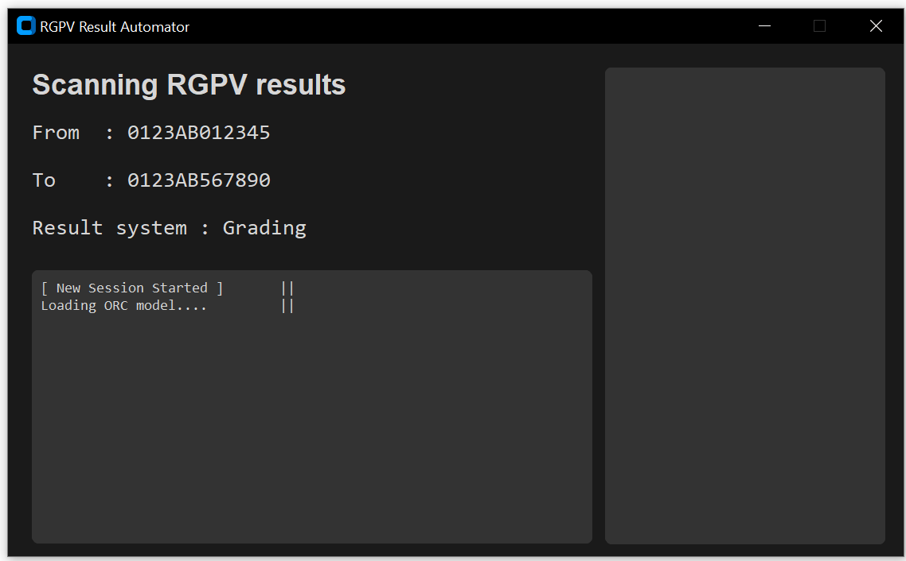
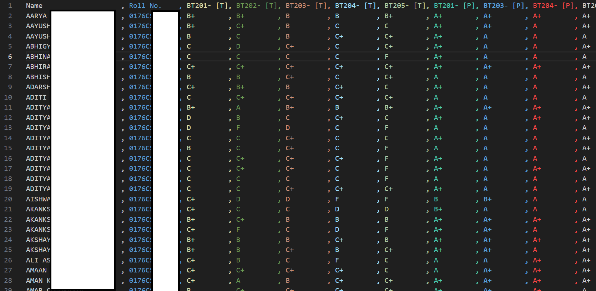
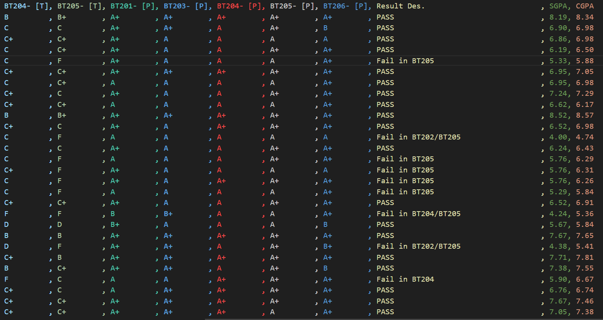

# RGPV Automator
A simple web-scraping tool for gathering RGPV Results in bulk

## Installation
### Release Build
* Click on **_Releases_** on the Right-Panel
* Select **_Assets_**
* Click on **_RGPV_Automator.zip_**
* Once Downloaded, unzip the file to your desired folder
  
### Source Code  
* Pre-Requisite
  * Python 3.12 or above
* Installation
  * Run `setup.py` once

## Usage 
* Just enter the first and last Enrollment number, Semester and Grading System  
* The Final output will be a `.csv` file with every student's result  
  > A 100 Student Batch may take 1-2hours to finish  

